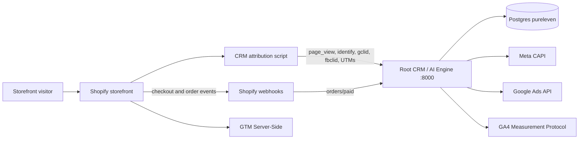
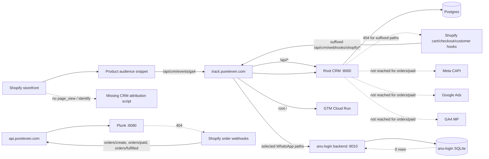
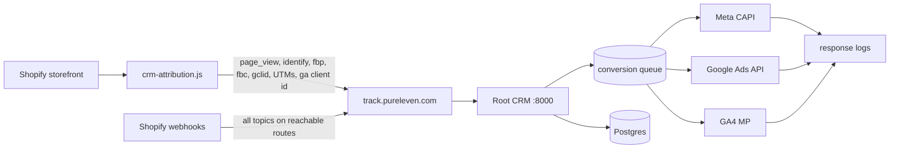
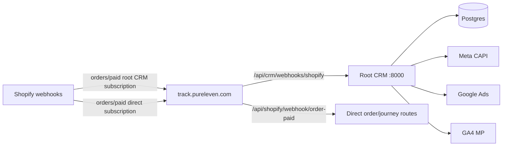

# Server-Side Tracking Architecture

Date: 2026-05-24

## Intended Conversion Flow

## Actual Live Flow Observed

## Nginx Routing Map

| Host/path | Upstream | Notes |
| --- | --- | --- |
| `track.pureleven.com/api/crm/meta-wa/send` | `127.0.0.1:8010` | WhatsApp send path |
| `track.pureleven.com/api/crm/wabis/send` | `127.0.0.1:8010` | WhatsApp send path |
| `track.pureleven.com/api/crm/ws/` | `127.0.0.1:8010` | WebSocket/WhatsApp path |
| `track.pureleven.com/api/crm/whatsapp/` | `127.0.0.1:8010` | WhatsApp route family |
| `track.pureleven.com/api/journey/` | `127.0.0.1:8010` | Journey route family |
| `track.pureleven.com/api/email/` | `127.0.0.1:8010` | Email route family |
| `track.pureleven.com/api/promo/` | `127.0.0.1:8010` | Promo route family |
| `track.pureleven.com/api/` | `127.0.0.1:8000` | Root CRM/AI Engine |
| `track.pureleven.com/` | GTM Cloud Run | Server-side GTM host root |
| `api.pureleven.com/` | `127.0.0.1:8080` | Plunk, not tracking app |

## Live Shopify Webhook Registration State

| Topic | Current address | Correctness |
| --- | --- | --- |
| `orders/create` | `https://api.pureleven.com/api/shopify/webhook/order-created` | Wrong host; reaches Plunk |
| `orders/paid` | `https://api.pureleven.com/api/shopify/webhook/order-paid` | Wrong host; reaches Plunk |
| `orders/fulfilled` | `https://api.pureleven.com/api/shopify/webhook/order-fulfilled` | Wrong host; reaches Plunk |
| `orders/cancelled` | `https://track.pureleven.com/api/crm/webhooks/shopify/order-cancelled` | Wrong route shape |
| `carts/create` | `https://track.pureleven.com/api/crm/webhooks/shopify/cart-create` | Wrong route shape |
| `carts/update` | `https://track.pureleven.com/api/crm/webhooks/shopify/cart-update` | Wrong route shape |
| `checkouts/create` | `https://track.pureleven.com/api/crm/webhooks/shopify/checkout-create` | Wrong route shape |
| `checkouts/update` | `https://track.pureleven.com/api/crm/webhooks/shopify/checkout-update` | Wrong route shape |
| `customers/create` | `https://track.pureleven.com/api/crm/webhooks/shopify/customer-create` | Wrong route shape |
| `customers/update` | `https://track.pureleven.com/api/crm/webhooks/shopify/customer-update` | Wrong route shape |

## Data Stores

### Postgres: root CRM

Main tracking tables and fields observed in code/schema:

- `crm_events`: browser/audience events, including `/api/crm/events/page_view` and `/api/crm/events/ga4`.
- `crm_customers`: customer identity fields including email, phone, `gclid`, `fbclid`, session/identity metadata.
- `crm_orders`: order records with `gclid`, `fbclid`, UTM fields, `fraud_score`, `capi_suppressed`, `offline_conversion_sent`.
- `conversion_feed`: intended conversion feed model in code, but recent live rows were 0.
- `crm_offline_conversions`: referenced by code, missing in live DB.

### SQLite: anu-login backend

Active DB path: `/opt/anu-login-backend/backend/data/anu_login.sqlite3`.

Important tables exist but are empty:

- `event_logs`: 0 rows.
- `journey_customers`: 0 rows.
- `journey_messages`: 0 rows.
- `journey_engagement_events`: 0 rows.

The live `journey_customers` table lacks expected attribution columns such as `meta_lead_id`, `google_gclid`, and `fbc`.

## Desired Remediated Architecture

The root app should be the system of record for conversion fan-out unless the anu-login service is explicitly migrated and made active.

## Post-Fix Live Routing

As of 2026-05-24, Shopify webhook readback shows the following corrected state:

- `orders/create`, `orders/paid`, and `orders/fulfilled` now have root CRM webhooks at `https://track.pureleven.com/api/crm/webhooks/shopify`.
- `orders/create`, `orders/paid`, and `orders/fulfilled` also retain direct journey webhooks at `https://track.pureleven.com/api/shopify/webhook/order-*`.
- `orders/cancelled`, cart, checkout, and customer webhooks now point to the unified root CRM endpoint.
- There are no remaining webhook addresses on `api.pureleven.com`.
- There are no remaining suffixed `/api/crm/webhooks/shopify/...` webhook addresses.

The currently verified live path is:

Destination delivery remains pending validation on the next real paid order.
