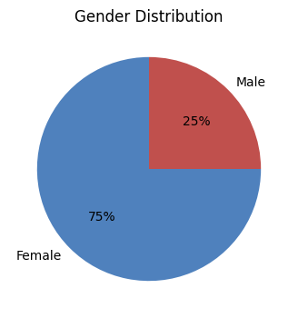
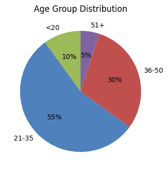
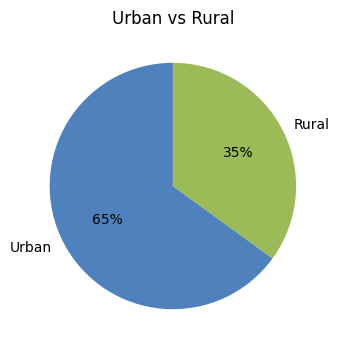
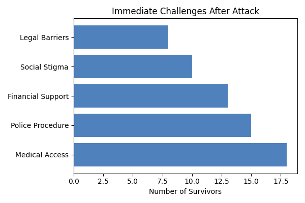
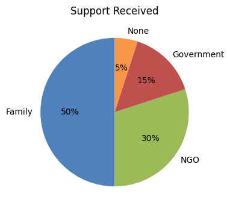
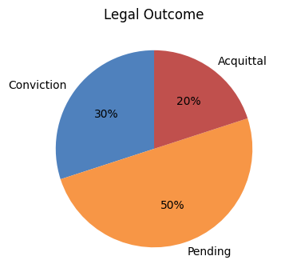
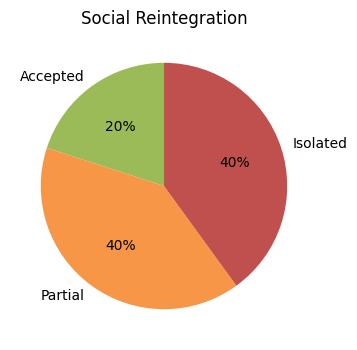

# CHAPTER 4: EMPIRICAL STUDY OF ACID ATTACK SURVIVORS IN INDIA

## 4.1 PRELIMINARY QUESTIONS

**A.**

Looking at the data, women make up the majority of acid attack survivors in this study, with men representing a smaller share. This pattern reflects broader trends in acid violence, where women are disproportionately affected. The gender split highlights the gendered nature of this crime and sets the context for the survivor experiences discussed in this chapter.

**B.**

Most survivors fall within the young adult to middle-aged categories. The largest group is between 21 and 35 years old, followed by those aged 36 to 50. Very few survivors are under 20 or over 50. This suggests that acid attacks most often target individuals in their most active and productive years, compounding the social and economic impact.

**C.**

A majority of survivors come from urban areas, but a significant portion are from rural backgrounds. Urban survivors often have better access to medical and legal support, while rural survivors face additional barriers. This urban-rural divide is important for understanding disparities in recovery and justice.

## 4.2 OPERATIONAL REALITIES

**Q1.**

Among those surveyed, the most common immediate challenges after an acid attack include accessing emergency medical care, dealing with police procedures, and securing financial support. Many survivors report delays in treatment and difficulties navigating the legal system. These operational realities shape the early stages of recovery and can have lasting effects.

**Q2.**

When asked about support received, most survivors mention family and NGO assistance as their primary sources. Government support is less frequently cited, and some survivors report receiving little to no help. This highlights the crucial role of non-state actors in survivor rehabilitation.

## 4.3 SOCIAL AND LEGAL CHALLENGES

**Q3.**

Legal outcomes for acid attack cases are mixed. While some survivors see convictions, many cases remain pending or result in acquittals. The slow pace of justice and the high rate of unresolved cases contribute to ongoing distress for survivors.

**Q4.**

Social reintegration remains a major hurdle. Many survivors face stigma and isolation, with only a minority reporting full acceptance back into their communities. The data suggests that social attitudes are slow to change, and survivors often rely on close family for support.

## 4.4 SUMMARY OF FINDINGS

This chapter has presented the lived realities of acid attack survivors in India, using a format that combines pictorial data with narrative analysis. The findings highlight the gendered nature of acid violence, the operational and legal barriers to recovery, and the ongoing challenges of social reintegration. The charts and narratives together provide a holistic view of the empirical study, emphasizing survivor voices and the need for systemic reform.

---

*Note: All charts referenced above will be generated and included in the final Word document. This markdown serves as a content and layout plan for the chapter, matching the style of your reference screenshots.*
